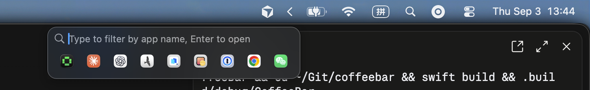

# CoffeeBar

**Hide the menu bar icons you don't need. Get them back with one click.**

A small, free, open-source menu bar manager for macOS. No screen recording permission, no subscription, no telemetry.

## Download

[**Download the latest release**](https://github.com/zjywill/coffeebar/releases/latest) → unzip → drag CoffeeBar into Applications.

Signed and notarized by Apple. Requires macOS 14 or later, Apple Silicon or Intel. Updates itself.

## Features

- **Expand and collapse.** Click `<` and the hidden icons slide into the menu bar; click any of them as usual. Click `<` again or anywhere else and they fold away. Nothing synthetic happens: no fake clicks, your pointer is never touched.
- **Panel with search** (optional, ⌥-click `<` or turn it on as the default). Every hidden icon listed by app; type to filter, Enter to open.
- **Drag to hide.** Hold ⌘ and drag an icon to the left of `<` to hide it, to the right to keep it. CoffeeBar remembers.
- **Arrange mode.** Right-click `<` → *Arrange Items…* to see everything at once and drag icons around.
- **Icons stay put.** After a restart, or when an app drops its icon somewhere random, it goes back where you put it.
- **New apps stay visible** until you decide to hide them.
- **System icons are never hidden.** Battery, Wi-Fi, Control Center, Spotlight and the input menu always stay.
- **Notch and narrow screens**: turn on *Reveal only the clicked item* and just that one icon is brought into the menu bar instead of the whole section.
- **Notch aware.** On a MacBook display with a notch the menu bar cannot show everything, so clicking the cup opens the panel there; on external displays it expands inline.
- **Only asks for Accessibility.** Nothing else.

## License

[AGPL-3.0](LICENSE). Building from source: [docs/DEVELOPMENT.md](docs/DEVELOPMENT.md).
